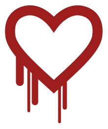
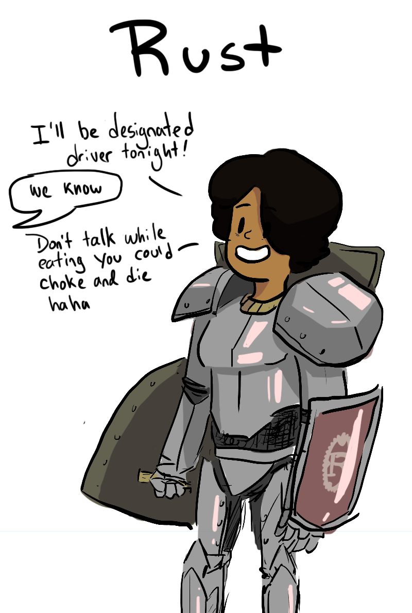

name: inverse
layout: true
class: center, middle, inverse
---
layout: false
background-color: #272822
background-image: url(rust-poka-yoke.png)

---
# Agenda

* What is poka-yoke?

* Examples of poka-yoke in software development

* The minefield of undefined behavior

* Safe programming with Rust

---
## What is poka-yoke?

* "mistake-proofing" or "inadvertent error prevention"
    * AKA "fool-proofing" and "defensive design"

* Formalized by Shigeo Shingo at Toyota in the 1960s

* Two types: "warning" and "control"

.right[]

---
## Everyday examples

* seatbelt alarms ("warning")

* spelling and grammar checkers ("warning")

* asymmetric electrical outlets ("control")

* microwave oven door ("control")

.right[]

---
## Benefits in industry

* Fewer mistakes and defects

* Less time training workers

* Reduced need for quality control

* Increased productivity

---
## Poka-yoke in software development

* Static analysis (e.g. linters, typecheckers)

* Test-driven development

* Code review

* Safe APIs (i.e. compile-time safety)

---
## API Safety

* Unsafe API:

```c++
// Parses the specified JSON document and extracts the requested field.
// Returns nullptr if document is malformed or field not found.
// Caller is responsible for deleting return value.
Json::Value* GetJsonField(const string& document, const string& fieldName);
```

--
* Safe(r) alternative:

```c++
optional<not_null<unique_ptr<Json::Value>>> GetJsonField(const Json::Value& document, const string& fieldName);
```

---
## Better concurrency through static analysis

```c++
class BankAccount {
private:
  Mutex mu;
  int   balance GUARDED_BY(mu);

  void depositImpl(int amount) {
    balance += amount;       // WARNING! Cannot write balance without locking mu.
  }

  void withdrawImpl(int amount) REQUIRES(mu) {
    balance -= amount;       // OK. Caller must have locked mu.
  }

public:
  void withdraw(int amount) {
    mu.Lock();
    withdrawImpl(amount);    // OK.  We've locked mu.
  }                          // WARNING!  Failed to unlock mu.

  void transferFrom(BankAccount& b, int amount) {
    mu.Lock();
    b.withdrawImpl(amount);  // WARNING!  Calling withdrawImpl() requires locking b.mu.
    depositImpl(amount);     // OK.  depositImpl() has no requirements.
    mu.Unlock();
  }
};
```

---
## More poka-yoke: choosing the least powerful tool for the job

* Restricted concurrency models (e.g. fork-join)

* Pure functional programming (no mutable state)

* Total functional programming (provably terminating computations)

.right[]

---
## Poka-yoke honorable mention: process isolation

* Multiple processes vs. multiple threads

* Erlang: "let it crash"

.right[]

---
background-color: #272822
background-image: url(undefined-behavior.png)

---
## An example of undefined behavior

```c++
// What do you think this will do?
int main(int, char**) {
  unsigned long a[1];
  a[3] = 0x7ffff7b23e61UL;
  (void) a;
  return 0;
}
```

(adapted from Blandy and Orendorff's Programming Rust)

--

```bash
$ gcc -Wall -Wextra overflow.cpp -g -o overflow
$ ./overflow
overflow: Error: .netrc file is readable by others
overflow: Remove password or make file unreadable by others.
```

---
## More undefined behavior

* Dangling pointers (AKA use-after-free)

* Null pointers

* Double frees

* Uninitialized memory

* Out-of-bounds reads and writes ("heap corruption detected")

* Data races

.right[]

---
## Why it's such a problem

* Hard to catch in tests

* Different behavior from debug vs. release builds

* Heisenbugs

* Can be exposed by unrelated changes

* May not surface until *years* later

* Really, *really* hard to debug (especially when the customer has you by the throat)

.right[]

---
## It's not just C/C++

* Java, Python, Go, etc. have undefined behavior, too!

```python
import threading 
  
x = 0
  
def increment(): 
    global x 
    x += 1
  
def thread_task(): 
    for _ in range(100000): 
        increment() 
  
def main_task(): 
    global x 
    x = 0
  
    t1 = threading.Thread(target=thread_task) 
    t2 = threading.Thread(target=thread_task) 
  
    t1.start() 
    t2.start() 
  
    t1.join() 
    t2.join() 
```

---
background-color: #272822
.center[]

---
## What is Rust?

* Memory- and concurrency-safe programming language from Mozilla

* Open source; community supported

* "Most loved" language on StackOverflow for past three years

.right[]

---
## Rust guarantees

.left-column[
* Memory-safe

* Concurrency-safe
    * No data races (concurrent reads and writes)
    * No mutable globals
    * Mutable access is exclusive access

* No undefined behavior

* Type-safe: encourages safe APIs

* Deterministic resource management
]

.right-column[
.right[]
]

---
## What's not covered by the warranty:

* Race conditions, deadlocks, and starvation still possible

* Resources can be unecessarily retained or intentionally leaked

* Misuse of `unsafe` keyword can break everything

* Application logic errors are your responsiblity

.right[]

---
## Rust advantages

* Portability
* Performance
* Productivity
    * fewer tests needed
    * less debugging
    * faster code reviews
    * mistakes caught early, when they're cheaper to fix

* Modern dependency manager
* Helpful error messages, documentation, and community
* Hygenic macro system
* Zero-cost C interop

.right[]

---
## Rust disadvantages

* Annoying evangelism from people like me

* Younger, smaller ecosystem

* Steep learning curve (YMMV)

* Long compile times

* Mental overhead compared to GC'd languages

* C++ interoperability requires manual effort

* Asyncronous programming harder than it should be (but improving rapidly)
    
* Jobs and candidates are relatively rare

.right[]

---
## Resources

* https://kanbanize.com/lean-management/improvement/what-is-poka-yoke/

* https://clang.llvm.org/docs/UndefinedBehaviorSanitizer.html

* https://clang.llvm.org/docs/ThreadSafetyAnalysis.html

* https://rust-lang.org

* https://reddit.com/r/rust
